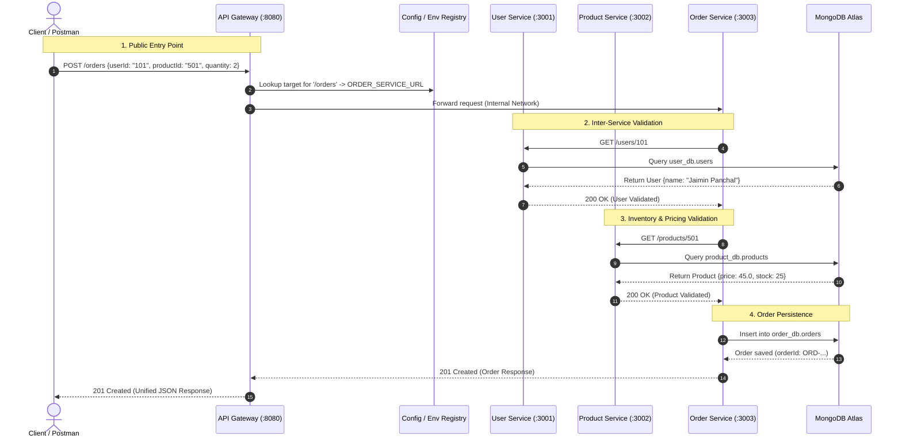

# Web Services & SOA Laboratory — Lab 7
## API Gateway, Service Discovery & Cloud Deployment
**Student ID:** 202512015  
**Course:** Web Services & Service Oriented Architecture (SOA)  
**Technology Stack:** Docker • Docker Compose • Node.js (Express.js) • `http-proxy-middleware` • MongoDB Atlas • Cloud Deployment (Render / Railway / Cloud VM) • Postman  

---

## 1. Executive Summary & Objective

In **Lab 6**, the monolithic backend was decomposed into three independently running microservices: **User Service**, **Product Service**, and **Order Service**, communicating over a private Docker network, with the API Gateway introduced as a conceptual pattern.

In **Lab 7**, we bring this architecture to enterprise production readiness across three core parts:
1. **Part A — Build a Real API Gateway (`api-gateway`)**:
   - Establish a single, unified public entry point for all client requests using Node.js and `http-proxy-middleware`.
   - Route incoming requests by path prefixes: `/users/*` ➔ User Service, `/products/*` ➔ Product Service, `/orders/*` ➔ Order Service.
   - Implement gateway-level health checks (`GET /health`), structured request logging, and centralized fault tolerance returning clean `502 Bad Gateway` / `503 Service Unavailable` JSON responses.
   - Enforce network boundary security in Docker Compose: **only the API Gateway's port (8080) is exposed externally**; backend microservices are accessible strictly inside the internal Docker bridge network.

2. **Part B — Service Discovery (Configuration-Based)**:
   - Externalize all downstream microservice locations into environment variables (`USER_SERVICE_URL`, `PRODUCT_SERVICE_URL`, `ORDER_SERVICE_URL`).
   - The API Gateway dynamically constructs its routing table at startup based on configuration rather than hardcoded URLs.
   - Provide zero-code reconfiguration proof and evaluate static config vs. dynamic service registries (Consul, Eureka, Kubernetes DNS).

3. **Part C — Cloud Deployment**:
   - Containerize and configure the API Gateway and microservices stack for cloud hosting (Render, Railway, Fly.io, or Cloud VMs).
   - Integrate persistent cloud database storage with **MongoDB Atlas**.
   - Validate end-to-end cloud execution through a single public cloud Gateway URL using Postman and automated test scripts.

---

## 2. Complete System Architecture & Network Boundary

### 2.1 Layer Responsibility & Reachability Matrix

| Layer | Responsibility | Network Reachability |
|---|---|---|
| **Client / Postman** | Sends requests to a single public IP / domain | **Public Internet** |
| **API Gateway** | Single entry point, reverse proxy routing (`/users`, `/products`, `/orders`), structured logging, health checks, centralized error handling | **Public Internet** (Port `8080` / Cloud URL) |
| **User Service** | User identity, profiles, student/faculty roles, department data | **Docker Network Only** (`campus-network:3001`) |
| **Product Service** | Product catalog, pricing, categories, inventory stock | **Docker Network Only** (`campus-network:3002`) |
| **Order Service** | Order creation, validation against User & Product services, order queries | **Docker Network Only** (`campus-network:3003`) |
| **MongoDB Atlas** | Managed cloud database backend (`user_db`, `product_db`, `order_db`) | **Internal Services only** (via TLS connection string) |

---

### 2.2 System Architecture Diagram

```
┌────────────────────────────────────────────────────────────────────────────────────────────────────────┐
│                                           PUBLIC INTERNET                                              │
│                                                                                                        │
│                 Client Browser / Mobile App / Postman (http://localhost:8080 or Cloud URL)             │
└───────────────────────────────────────────────────┬────────────────────────────────────────────────────┘
                                                    │
                                                    │ HTTP Requests (/users, /products, /orders, /health)
                                                    ▼
┌────────────────────────────────────────────────────────────────────────────────────────────────────────┐
│                                          API GATEWAY (Port 8080)                                       │
│  ┌──────────────────────────────────────────────────────────────────────────────────────────────────┐  │
│  │  • Reverse Proxy (http-proxy-middleware)     • Health Probes (GET /health)                       │  │
│  │  • Structured Request Logger                 • Centralized Error Interceptor (502/503/504)       │  │
│  │  • Service Discovery Registry (Env Config)   • CORS & Body Streaming                             │  │
│  └────────────────────────────────────────────────┬─────────────────────────────────────────────────┘  │
└───────────────────────────────────────────────────┼────────────────────────────────────────────────────┘
                                                    │
                 ═══════════════════════════════════╪════════════════════════════════════
                 ║ DOCKER BRIDGE NETWORK BOUNDARY (campus-network)                      ║
                 ║ (Internal microservices are NOT exposed to the host/internet)        ║
                 ═══════════════════════════════════╪════════════════════════════════════
                                                    │
             ┌──────────────────────────────────────┼──────────────────────────────────────┐
             │ /users/*                             │ /products/*                          │ /orders/*
             ▼                                      ▼                                      ▼
   ┌───────────────────┐                  ┌───────────────────┐                  ┌───────────────────┐
   │   user-service    │                  │  product-service  │                  │   order-service   │
   │   (Port 3001)     │                  │   (Port 3002)     │                  │   (Port 3003)     │
   │   • CRUD /users   │                  │   • CRUD /products│                  │   • POST /orders  │
   │   • Private Net   │                  │   • Private Net   │                  │   • GET /orders   │
   └─────────┬─────────┘                  └─────────┬─────────┘                  └─────────┬─────────┘
             │                                      │                                      │
             │                                      │         Inter-Service Calls (REST)   │
             │                                      │◀─────────────────────────────────────┤
             │                                      │   GET http://product-service:3002    │
             │                                      │                                      │
             │                                      └──────────────────────────────────────┤
             │◀────────────────────────────────────────────────────────────────────────────┘
             │                     GET http://user-service:3001
             │
             ▼
   ═══════════════════════════════════════════════════════════════════════════════════════════════════════
   ║ PERSISTENT DATABASE LAYER (Local Docker MongoDB or Cloud MongoDB Atlas Cluster)                     ║
   ═══════════════════════════════════════════════════════════════════════════════════════════════════════
             │                                      │                                      │
             ▼                                      ▼                                      ▼
   ┌───────────────────┐                  ┌───────────────────┐                  ┌───────────────────┐
   │ Database: user_db │                  │Database:product_db│                  │ Database: order_db│
   └───────────────────┘                  └───────────────────┘                  └───────────────────┘
```

---

### 2.3 Mermaid Sequence Flow



---

## 3. Gateway Routing & Endpoints Specification

All client interactions occur through the API Gateway. The table below outlines how gateway paths map to downstream services:

| Gateway Path | HTTP Method | Target Service | Downstream Route | Purpose |
|---|---|---|---|---|
| `GET /health` | GET | `api-gateway` | Internal Handler | Reports gateway status, uptime, and service registry URLs |
| `GET /health?probe=true` | GET | `api-gateway` | Probes all targets | Real-time healthcheck across User, Product, and Order services |
| `GET /` | GET | `api-gateway` | Internal Handler | Gateway overview, active environment, and route documentation |
| `GET /users` | GET | `user-service` | `GET /users` | Retrieve all users |
| `GET /users/:id` | GET | `user-service` | `GET /users/:id` | Retrieve single user by ID |
| `POST /users` | POST | `user-service` | `POST /users` | Register a new user |
| `PUT /users/:id` | PUT | `user-service` | `PUT /users/:id` | Update existing user details |
| `DELETE /users/:id` | DELETE | `user-service` | `DELETE /users/:id` | Remove user profile |
| `GET /products` | GET | `product-service` | `GET /products` | Retrieve product catalog |
| `GET /products/:id` | GET | `product-service` | `GET /products/:id` | Retrieve single product by ID |
| `POST /products` | POST | `product-service` | `POST /products` | Add new product to catalog |
| `PUT /products/:id` | PUT | `product-service` | `PUT /products/:id` | Update product price/inventory |
| `DELETE /products/:id` | DELETE | `product-service` | `DELETE /products/:id` | Remove product |
| `POST /orders` | POST | `order-service` | `POST /orders` | Create order with inter-service verification |
| `GET /orders` | GET | `order-service` | `GET /orders` | List all submitted orders |
| `GET /orders/:id` | GET | `order-service` | `GET /orders/:id` | Retrieve specific order |

---

## 4. Discussion Questions & Architectural Analysis

### 4.1 Discussion Question 1 (Part A): Why Introduce an API Gateway Instead of Direct Client-to-Service Calls?

In a distributed microservices ecosystem, allowing external clients (browsers, mobile apps, third-party consumers) to communicate directly with individual microservices introduces severe architectural drawbacks:

1. **Single Entry Point & Encapsulation**:
   - Without a gateway, clients must track multiple IP addresses, hostnames, and ports (`:3001`, `:3002`, `:3003`).
   - The API Gateway provides a single stable domain/IP, completely abstracting the backend topology. Microservices can be split, merged, migrated, or scaled without altering client code.
2. **Security & Attack Surface Reduction**:
   - In direct communication, every microservice must expose a public port to the internet.
   - With an API Gateway, **only the gateway is exposed**. Backend microservices reside inside an isolated private Docker network, preventing unauthorized access, database scraping, and unauthenticated internal requests.
3. **Centralization of Cross-Cutting Concerns**:
   - Cross-cutting responsibilities (structured access logging, SSL/TLS termination, rate limiting, CORS configuration, API authentication/JWT validation) can be handled once at the gateway rather than re-implemented across every microservice in different programming languages.
4. **Resilient Error Handling & Fault Isolation**:
   - If a backend service fails, the gateway intercepts connection drops and timeouts, returning standardized JSON error messages (`502 Bad Gateway` / `503 Service Unavailable`) rather than raw network drops or browser hangs.
5. **Protocol Translation & Payload Transformation**:
   - Gateways can aggregate multiple microservice calls into a single response (API composition/BFF pattern) and translate between external protocols (HTTP/REST) and internal protocols (gRPC, message queues).

---

### 4.2 Discussion Question 2 (Part B): Static / Config-Based Discovery vs. Dynamic Service Discovery

In this lab, we implemented **Configuration-Based Service Discovery** by externalizing microservice endpoints into environment variables (`USER_SERVICE_URL`, `PRODUCT_SERVICE_URL`, `ORDER_SERVICE_URL`).

| Dimension | Static / Config-Based Discovery (Lab 7) | Dynamic Service Discovery (Consul / Eureka / K8s DNS) |
|---|---|---|
| **Mechanism** | Environment variables or JSON/YAML configuration loaded at startup. | Centralized dynamic registry with active heartbeat checks and real-time DNS/API query. |
| **Instance Scaling** | Supports fixed, known hostnames/ports. Cannot automatically detect new replicas without config update and restart. | Automatically registers new container instances when auto-scaling up, and deregisters upon scale-down. |
| **Health Monitoring** | Passive (gateway discovers failure only upon attempting a request). | Active (services send periodic heartbeats; unhealthy nodes are automatically removed from routing pool). |
| **Load Balancing** | Relies on external reverse proxy or static IP. | Provides dynamic client-side (e.g., Spring Cloud LoadBalancer) or server-side round-robin load balancing across replica sets. |
| **Complexity & Overhead** | Extremely lightweight, zero additional infrastructure, simple debugging. | Requires maintaining dedicated registry clusters (e.g., HashiCorp Consul, Netflix Eureka, or etcd). |
| **Best Used For** | Small-to-medium microservices architectures, container orchestration with static service names (Docker Compose / Render). | Large-scale elastic cloud clusters, Kubernetes enterprise deployments, and dynamic multi-region microservices. |

**What Dynamic Service Discovery Adds**:
Dynamic registries allow ephemeral containers with dynamically assigned IP addresses (common in Kubernetes and AWS ECS) to automatically announce their presence, participate in traffic distribution, handle canary/blue-green deployments, and gracefully withdraw during deployments without requiring gateway restarts.

---

## 5. Implementation Details

### 5.1 API Gateway Service (`api-gateway/`)

The API Gateway is built with **Node.js (Express.js)** and **`http-proxy-middleware`**:
- `src/config/services.js`: Externalized service registry mapping service identifiers to environment variables.
- `src/middleware/logger.js`: Custom structured logger recording timestamp, HTTP method, requested route, matched target service, response status code, and latency in milliseconds.
- `src/middleware/errorHandler.js`: Intercepts `ECONNREFUSED`, `ENOTFOUND`, and `ETIMEDOUT` errors from downstream services, returning a structured JSON payload:
  ```json
  {
    "success": false,
    "error": "Service Unavailable",
    "statusCode": 503,
    "service": "User Service",
    "targetUrl": "http://user-service:3001",
    "code": "ECONNREFUSED",
    "message": "The downstream microservice 'User Service' is currently offline or unreachable. Please verify that the container is running.",
    "requestedPath": "/users",
    "timestamp": "2026-09-25T09:30:00.000Z"
  }
  ```
- `src/routes/health.js`: Provides `GET /health` and real-time live probe `GET /health?probe=true` to inspect the responsiveness of all downstream microservices.
- `src/app.js`: Connects CORS, request logging, body streaming fixes (`fixRequestBody`), and mounts proxy routes dynamically based on configuration.

---

### 5.2 Network Isolation in Docker Compose (`compose.yaml`)

Only the API Gateway exposes port `8080:8080` to the host. The `user-service`, `product-service`, and `order-service` utilize `expose` rather than `ports`, rendering them accessible **only within the `campus-network` bridge**:

```yaml
services:
  # API Gateway (Public Single Entry Point)
  api-gateway:
    build:
      context: ./api-gateway
      dockerfile: Dockerfile
    container_name: api-gateway
    ports:
      - "8080:8080"
    environment:
      PORT: 8080
      USER_SERVICE_URL: http://user-service:3001
      PRODUCT_SERVICE_URL: http://product-service:3002
      ORDER_SERVICE_URL: http://order-service:3003
    depends_on:
      - user-service
      - product-service
      - order-service
    networks:
      - campus-network

  # Internal Microservice (No host ports mapped)
  user-service:
    build:
      context: ./user-service
      dockerfile: Dockerfile
    container_name: user-service
    expose:
      - "3001"
    environment:
      PORT: 3001
      MONGO_URI: mongodb://mongodb:27017/user_db
    networks:
      - campus-network
```

---

## 6. Part C — Cloud Deployment Guide

The containerized stack is fully prepared for multi-service cloud hosting on platforms like **Render**, **Railway**, or any Cloud Virtual Machine (AWS EC2 / GCP Compute Engine / Azure VM).

### 6.1 Cloud Environment Architecture (with MongoDB Atlas)
```
[ Client / Postman ]
        │
        ▼ (HTTPS)
[ Cloud API Gateway (e.g. Render / Railway) ]
        │
        ├─► [ User Microservice ]    ──► [ MongoDB Atlas: user_db ]
        ├─► [ Product Microservice ] ──► [ MongoDB Atlas: product_db ]
        └─► [ Order Microservice ]   ──► [ MongoDB Atlas: order_db ]
```

### 6.2 Step-by-Step Cloud Deployment on Render (Blueprint / Web Services)

1. **MongoDB Atlas Setup**:
   - Create a free cluster on [MongoDB Atlas](https://www.mongodb.com/cloud/atlas).
   - Create database user credentials and allow network access (`0.0.0.0/0`).
   - Copy connection string: `mongodb+srv://<username>:<password>@cluster0.abcde.mongodb.net/?retryWrites=true&w=majority`.

2. **Deploy via `render.yaml` Blueprint**:
   - Push this repository to GitHub.
   - On the Render dashboard, click **New +** ➔ **Blueprint**.
   - Connect the repository. Render will automatically parse [render.yaml](file:///d:/Jaimin_Files/Sem3/SOA/Lab/202512015_Lab6_Microservices/render.yaml) and create:
     - `campusconnect-api-gateway` (Web Service)
     - `campusconnect-user-service` (Web Service)
     - `campusconnect-product-service` (Web Service)
     - `campusconnect-order-service` (Web Service)
   - In the Render environment variables for each backend service, set `MONGO_URI` to your MongoDB Atlas connection string (specifying `/user_db`, `/product_db`, `/order_db` respectively).

3. **Verify Public Gateway URL**:
   - Obtain your public API Gateway URL (e.g., `https://campusconnect-api-gateway.onrender.com`).
   - Run Postman or curl tests directly against this public cloud endpoint.

---

## 7. How to Run & Verify Locally

### 7.1 Start the Entire Stack via Docker Compose
Ensure Docker Desktop is running on your machine, then execute:
```bash
# Navigate to the project directory
cd d:/Jaimin_Files/Sem3/SOA/Lab/202512015_Lab6_Microservices

# Build and start all 5 containers (Gateway + 3 Microservices + MongoDB)
docker compose up --build -d

# Verify running containers
docker compose ps
```

---

### 7.2 Run Automated PowerShell Test Suite
An automated verification test script [test_gateway.ps1](file:///d:/Jaimin_Files/Sem3/SOA/Lab/202512015_Lab6_Microservices/test_gateway.ps1) is included:
```powershell
.\test_gateway.ps1
```
For testing against a cloud-deployed gateway:
```powershell
.\test_gateway.ps1 -GatewayUrl "https://your-api-gateway.onrender.com"
```

The test script automatically validates:
1. Gateway health and service registry discovery (`GET /health`).
2. User service routing through gateway (`GET /users`, `GET /users/101`).
3. Product service routing through gateway (`GET /products`, `GET /products/501`).
4. Order placement via gateway with inter-service validation across User and Product services (`POST /orders`).
5. Security boundary enforcement (confirms ports 3001, 3002, 3003 cannot be contacted directly from the host).
6. Centralized fault tolerance (stops `user-service`, asserts Gateway returns controlled `503 Service Unavailable`, restarts service, and asserts automatic recovery).

---

### 7.3 Manual cURL Verification Commands

#### 1. Check Gateway Health
```bash
curl -X GET http://localhost:8080/health
```

#### 2. Probe All Downstream Services
```bash
curl -X GET http://localhost:8080/health?probe=true
```

#### 3. Fetch Users via Gateway
```bash
curl -X GET http://localhost:8080/users
```

#### 4. Fetch Products via Gateway
```bash
curl -X GET http://localhost:8080/products
```

#### 5. Place an Order via Gateway
```bash
curl -X POST http://localhost:8080/orders \
  -H "Content-Type: application/json" \
  -d '{"userId":"101","productId":"501","quantity":2}'
```

#### 6. Verify Isolation (Direct access should fail)
```bash
curl http://localhost:3001/users
# Result: Failed to connect / Connection refused
```

---

## 8. Postman Collection

The complete Postman collection for Lab 7 is located at:  
[postman/CampusConnect_Lab7_API_Gateway.postman_collection.json](file:///d:/Jaimin_Files/Sem3/SOA/Lab/202512015_Lab6_Microservices/postman/CampusConnect_Lab7_API_Gateway.postman_collection.json)

### Importing and Running in Postman:
1. Open Postman ➔ Click **Import** ➔ Select `CampusConnect_Lab7_API_Gateway.postman_collection.json`.
2. The collection defines a collection variable `gateway_url` initialized to `http://localhost:8080`.
3. To test a cloud deployment, simply edit `gateway_url` to your public cloud URL (e.g., `https://campusconnect-gateway.onrender.com`).
4. Run all requests sequentially or execute the full collection via **Postman Collection Runner**.

---

## 9. Conclusion

Lab 7 successfully transforms the microservices architecture into an enterprise-grade, cloud-ready deployment:
- **Part A** built a resilient, single-entry API Gateway with routing, logging, and 502/503 fault isolation while securing backend services inside private network boundaries.
- **Part B** externalized service discovery into configurable registries, allowing zero-code updates and establishing the conceptual foundation for dynamic service registries.
- **Part C** prepared the full stack for cloud deployment with MongoDB Atlas, unified public endpoints, and comprehensive automated test suites.
